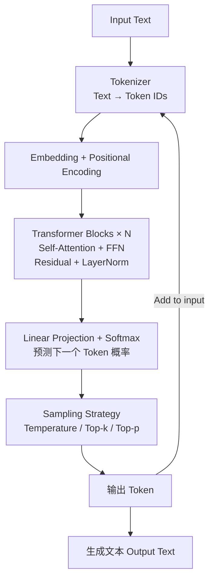

## 1 Introduction
### 1.1 什么是 LLM（Large Language Model）
**大语言模型（LLM）** 是基于深度学习的自然语言处理模型，通常采用 **Transformer 架构**，在海量文本数据上进行预训练，能够学习语言的统计规律和语义结构，从而完成多种任务。

### 1.2 LLM 的核心作用
- **语言建模（Language Modeling）**：学习条件概率  
- **通用语言能力迁移**：预训练 + 下游任务微调（Fine-tuning）
- **统一建模范式**：同一模型可解决多种 NLP 任务（范式迁移）

### 1.3 LLM 基础知识思维导图
![[LLM_Achitecture.png]]

---

## 2. Working With Text Data

> 目标：将“自然语言文本”转换为“神经网络可处理的数值表示”。

### 2.1 Tokenizer（分词器）
将文本拆分为最小处理单元（Token）。  
- Token 可以是：词、子词（Subword）、字符  
- 常见方法：BPE（Byte Pair Encoding）、WordPiece  

**作用**：降低词表规模，提高对未登录词的泛化能力。

### 2.2 Convert Tokens into Token IDs
将每个 Token 映射为唯一整数 ID，构成模型输入序列（如将`你`映射到 `[50256, 15496, 995]`），构建ID与Token之间相互的映射关系（字典）

### 2.3 Add Special Tokens
常见特殊 Token：
- `[BOS]`：句子开始  
- `[EOS]`：句子结束  
- `[PAD]`：填充对齐  
- `[MASK]`：用于掩码语言模型（如 BERT）

**作用**：为模型提供结构与边界信息。

### 2.4 Embedding
**定义**：将离散的 Token ID 映射为连续向量  
$$
\text{Embedding}: \mathbb{Z} \rightarrow \mathbb{R}^d
$$

**作用**：  
- 让语义相近的词在向量空间中距离更近  
- 作为 Transformer 的输入特征表示

### 2.5 Encoding Word Position
**定义**：为序列中的每个 Token 注入位置信息  

原因：Transformer 本身对顺序不敏感  
常见方法有固定正弦位置编码（Sinusoidal）；可学习位置编码（Learnable Positional Embedding）

**关系总结**：  
> 文本 → Token → Token ID → Embedding + Position Encoding → Transformer 输入

### 2.6 Text Data Process Architecture
![[Process_Data.png]]

---

## 3. Coding Attention Mechanisms：注意力机制

### 3.1 Self-Attention（自注意力机制）
>假设我们想开发一个语言翻译模型，将文本从一种语言翻译成另一种语言。我们不能简单地逐词翻译文本，因为源语言和目标语言之间存在语法结构。

自注意力的目标是为每个输入元素计算一个**上下文向量**，该向量结合了所有其他输入元素的信息。即计算每个输入元素在这个上下文向量中各自所占的比例。

大致的思路是计算 `score` 后 `softmax`，最后加权。如下图所示（各元素对 $x^{(2)}$ 的注意力分数以及形成的上下文向量）
![[Simplified_Attention.png]]

以此类推，可以得到所有输入元素的 `Attention Weights`，如下图所示：
![[Simplified_Attention_Weights.png]]

### 3.2 Q, K, V 机制
- **Query（Q）**：当前词“想要找什么信息”  
- **Key（K）**：每个词“能提供什么信息”  
- **Value（V）**：真正参与加权求和的信息内容  

注意力权重计算过程：
$$
\text{score}(i, j) = Q_i \cdot K_j
$$
$$
\alpha_{ij} = \text{softmax}(\text{score}(i, j))
$$
$$
\text{Context}_i = \sum_j \alpha_{ij} V_j
$$
![[QKV_single.png]]
![[QKV.png]]

### 3.4 Mask、Dropout 与多头注意力
1. **Mask**
	在 GPT 中使用 **因果掩码（Causal Mask）**，防止模型“看到未来信息”![[Casual_Mask.png]]
	
2. **Dropout**
	  随机丢弃部分神经元，用来防止过拟合![[Mask_Dropout.png]]
3. **Multi-Head Attention（多头注意力）**
	并行计算多个注意力子空间（不同 head 关注不同类型的语义关系），把最后的结果拼接起来![[Multiply_Head_Attention.png]]

**模块关系**：  
> 输入嵌入 → Q/K/V 线性映射 → Self-Attention → 多头拼接 → 输出表示

---

## 4. A GPT Model
### 4.1 GPT Model
标准结构如下：
> Feed Forward 结构为 `Linear Layer` -> `GELU activation` -> `Linear Layer`
![[GPT_Model.png]]

### 4.2 文本生成（Generate Text）
GPT 采用 **自回归（Autoregressive）生成方式**：
$$
P(x) = \prod_{t=1}^{T} P(x_t \mid x_{<t})
$$

流程：输入上下文 → 预测下一个 token → 拼接 → 继续预测（此时 `no_grad`）
![[Text_Generation.png]]

---

## 5. Pretraining & Sampling：预训练与生成策略
![[LLM_Train.png]]
### 5.1 预训练目标函数：交叉熵（Cross-Entropy Loss）
**定义**：  
度量模型预测分布与真实分布之间的差距。

$$
\mathcal{L} = - \sum_{t} \log P(x_t \mid x_{<t})
$$

### 5.2 Temperature
用来调节输出分布的“平滑程度”  
- 温度低 → 更确定、更保守  
- 温度高 → 更随机、更有创造性  
```python
def softmax_with_temperature(logits, temperature): 
	scaled_logits = logits / temperature 
	return torch.softmax(scaled_logits, dim=0)
```

### 5.3 Top-k 采样 
我们可以将采样 token 限制为最有可能的 top-k 个 token，并通过将其他所有 token 的概率分数屏蔽为负无穷大（-inf）来排除它们的选择过程

**关系总结**：  
> 预训练决定“模型能力上限”，采样策略决定“生成风格与多样性”

---

## 6. 总体结构关系图


---

## 7 Fine Tuning
详情整理在 [[Fine Tuning]]中，包含Fine Tuning 具体介绍以及相关方法

---

## Reference
1. [LLMs from scratch](https://github.com/rasbt/LLMs-from-scratch): Implement a ChatGPT-like LLM in PyTorch from scratch, step by step.
2. [Hugging Face LLM-course](https://huggingface.co/learn/llm-course/)

