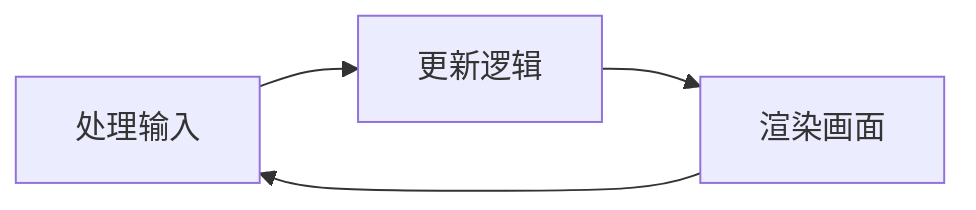
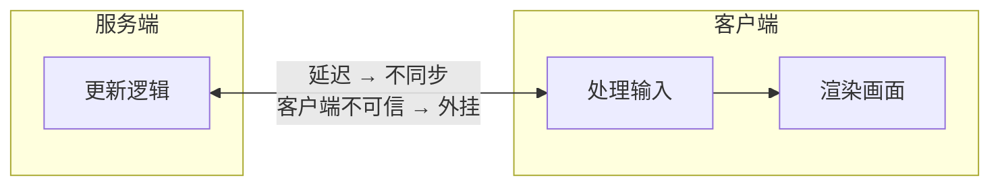

[VoidMatrix 课程](https://www.bilibili.com/cheese/play/ss972562983?csource=common_hp_favorite_null&spm_id_from=333.1387.0.0)==核心问题：开发联机游戏和单机游戏在思路上有什么不同？==

## 知识目录
### 第一章 联机概念与通信基础
- [[2 联机游戏网络基石 TCP-IP模型]]
- [[3 联机游戏网络底层 socket 系统 API]]
- [[4 TCP 沾包拆包：从数据流中精准提取信息包]]

### 第二章 核心架构与同步机制
- [[5 同步与序列化：内存拷贝与序列化原则]]
- [[6 联机游戏架构]]
- [[7 Actor 模型]]
- [[8 世界状态同步]]

### 第三章 进阶优化和专项技术
- [[9 联机的三大挑战]]
- [[10 协议选择 从TCP、UDP优劣到E-Net]]
- [[11 同步策略]]
---

## 单机游戏

---

## 联机游戏
理想情况下的架构会带来**延迟**以及**可信度**的问题

现实的网络架构是一个下层为上层服务、上层返回信息给下层的金字塔
- **网络 I/O 层（Network I/O）**
    
    - Socket / UDP / TCP / WebSocket
        
    - 负责：收发字节流、封包、拆包
        
- **连接管理层（Connection Management）**
    
    - 连接生命周期管理，保证包能正确传到（建连 / 心跳 / 断连 / 重连）
        
    - 会话管理、身份绑定（Session / Connection / Player 映射）
        
- **同步 / RPC 层（Sync / RPC）**
    
    - 协议编解码、消息分发
        
    - **状态同步**、RPC 调用、命令路由
        
    - 可扩展：可靠 UDP、顺序保证、重传机制
        
- **游戏系统层（Game Systems）**
    
    - 模块化系统：背包、战斗、任务、匹配、排行榜
        
    - 不直接操作网络，只处理业务系统状态
        
- **游戏逻辑层（Game Logic）**
    
    - 玩法规则、数值结算、胜负判定
        
    - 与引擎/网络解耦，专注规则表达

